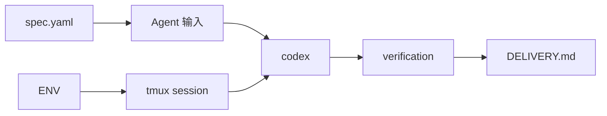

# v23-old-job-compat-query 高层设计

## 架构约束

本用例只依赖任务包内声明的输入。Agent 上下文通过 `PROMPT.md`、`AGENTS.md`、`CLAUDE.md` 与 `docs/` 文件表达；`ENV` 仅用于进程环境注入，不作为普通上下文文件提供给 Agent 阅读。

## 运行关系

```mermaid
flowchart LR
  Spec["spec.yaml"] --> Agent["Agent 输入"]
  Env["ENV"] --> Tmux["tmux session"]
  Agent --> Exec["codex"]
  Tmux --> Exec
  Exec --> Verify["verification"]
  Verify --> Report["DELIVERY.md"]
```
