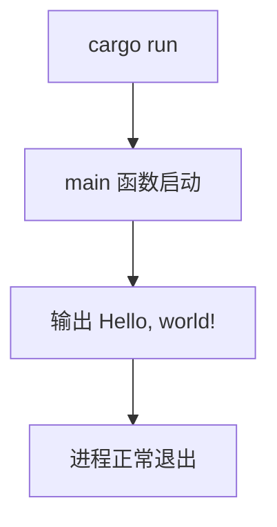

# HLD - hello-rust

## 架构目标

该测试仓库采用最小 Rust binary crate 架构，降低业务复杂度，突出 spec-executor 对空仓库初始化、文件生成和命令验证的调度能力。

## 组件设计

| 组件 | 职责 |
| --- | --- |
| `Cargo.toml` | 声明 Rust 包元数据与 binary crate。 |
| `src/main.rs` | 实现程序入口和标准输出逻辑。 |

## 执行流程

## 技术决策

程序不需要模块拆分、配置读取或外部依赖。标准库的 `println!` 足以满足需求。
